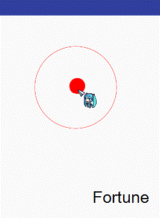

# GooView
> 仿QQ未读信息的小红点
### 下面是示例图

### 主要知识点
* Path
```Java
 path.moveTo(mStickPoints[0].x, mStickPoints[0].y);
                //画贝塞尔曲线:第一个点是控制点,第二个点是目标点
                path.quadTo(mControlPoint.x, mControlPoint.y, mDragPoints[0].x, mDragPoints[0].y);
                //画直线
                path.lineTo(mDragPoints[1].x, mDragPoints[1].y);
                //第二条贝塞尔
                path.quadTo(mControlPoint.x, mControlPoint.y, mStickPoints[1].x, mStickPoints[1].y);
                path.close();//自动封闭（回到起始点）
```

